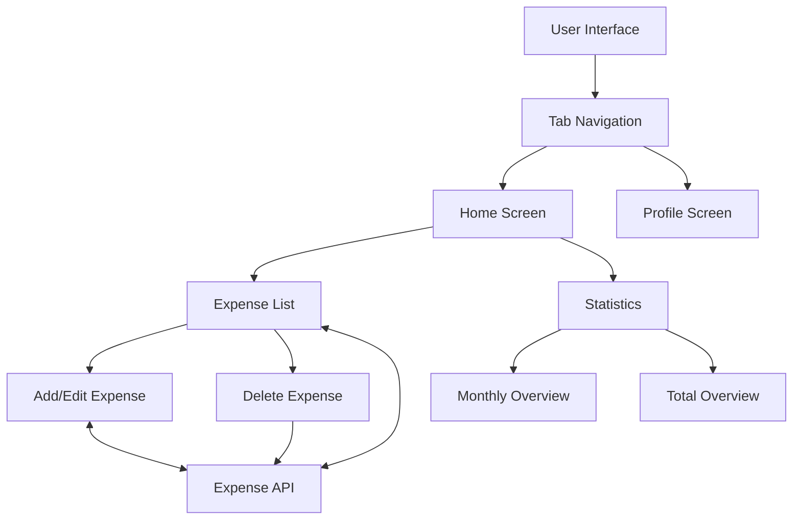

# Finance Tracker Mobile App

A modern, user-friendly mobile application for tracking personal expenses with real-time updates and intuitive visualization.

## App Architecture

### Frontend Architecture
```
finance-tracker/
├── app/
│   ├── (tabs)/
│   │   ├── _layout.js       # Tab navigation configuration
│   │   ├── home.js          # Home screen with expense list and stats
│   │   └── profile.js       # User profile management
│   ├── expense-details.js   # Add/Edit expense form
│   └── index.js            # Entry point/Splash screen
├── constants/
│   └── Colors.js           # Theme configuration
├── hooks/
│   └── useColorScheme.js   # Theme management
└── components/             # Reusable UI components
```

## Data Flow Diagram



## API Endpoints

### Base URL
```
https://67ac71475853dfff53dab929.mockapi.io/api/v1
```

### Endpoints

1. **Expenses**
   - GET `/expenses` - Fetch all expenses
   - GET `/expenses/:id` - Get specific expense
   - POST `/expenses` - Create new expense
   - PUT `/expenses/:id` - Update expense
   - DELETE `/expenses/:id` - Delete expense

2. **Users**
   - GET `/users` - Fetch user profile
   - GET `/users/:id` - Get specific user
   - PUT `/users/:id` - Update user profile

## Pages and Features

### 1. Home Screen
- Expense statistics and overview
  - Monthly comparison (This month vs Last month)
  - Total expenses overview
  - Average expense calculation
  - Highest expense tracking
- Search functionality
  - Search by title, description, or amount
- Expense list
  - View all expenses
  - Delete expenses
  - View expense details
- Pull-to-refresh functionality

### 2. Add/Edit Expense Screen
- Form validation
  - Required title
  - Valid amount (positive numbers only)
  - Optional description
- Real-time amount formatting
- Success/Error notifications
- Automatic list update

### 3. Profile Screen
- User information display
- Theme preferences
- App settings

## Color Scheme

### Light Mode
- Primary: `#2E7D32` (Deep green for growth)
- Secondary: `#1976D2` (Trustworthy blue)
- Background: `#FFFFFF` (Clean white)
- Card Background: `#F5F9FF` (Light blue tint)
- Text: `#1C2833` (Dark blue-gray)

### Dark Mode
- Primary: `#66BB6A` (Lighter green)
- Secondary: `#42A5F5` (Lighter blue)
- Background: `#0A1929` (Deep blue-black)
- Card Background: `#132F4C` (Navy blue)
- Text: `#FFFFFF` (White)

## State Management
- Local state using React hooks
- Real-time updates
- Optimistic UI updates
- Error handling and recovery

## Data Validation
- Amount: Positive numbers only, max 2 decimal places
- Title: Required, max 50 characters
- Description: Optional, max 200 characters

## Future Enhancements
1. Authentication system
2. Categories management
3. Budget planning
4. Export functionality
5. Charts and advanced analytics
6. Multiple currency support
